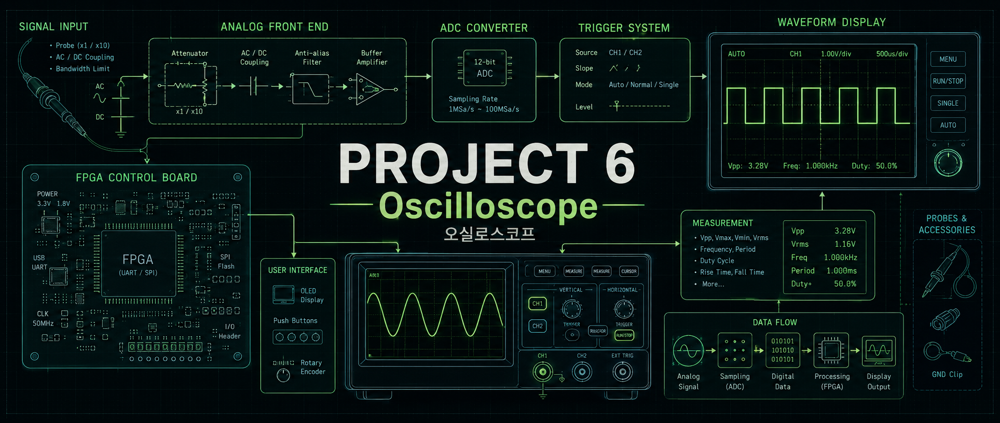
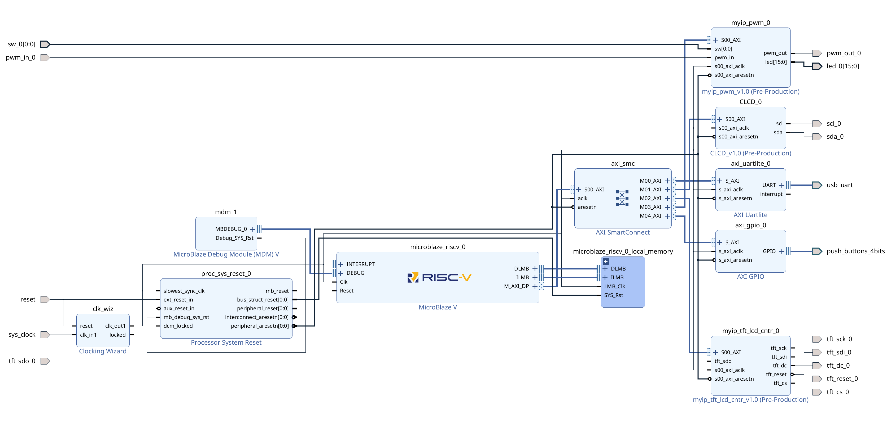
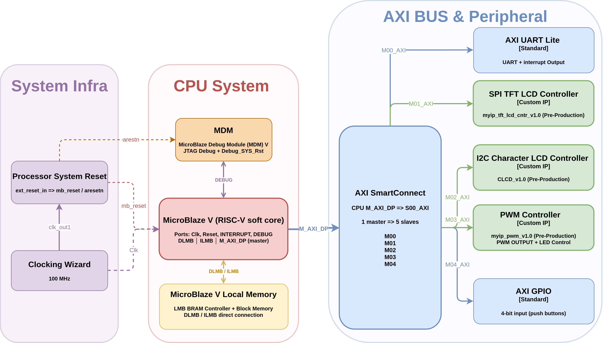
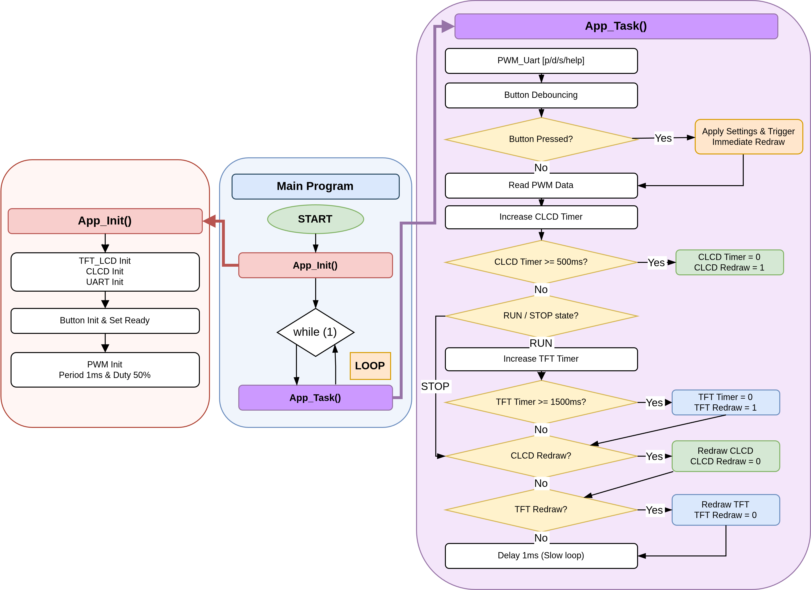
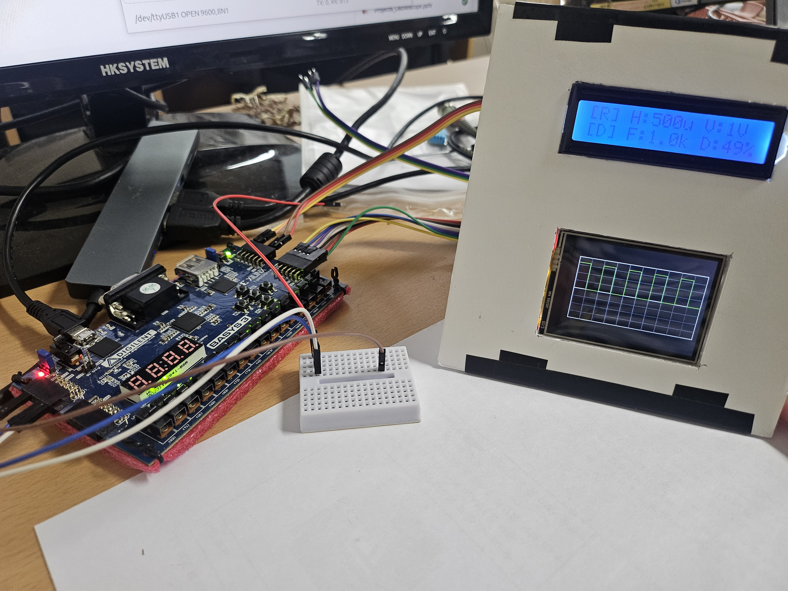

# 📈 Project 6 DIGISCOPE

## **1. Project Summary (프로젝트 요약)**
Basys3(Artix-7 FPGA)와 MicroBlaze RISC-V 소프트 프로세서를 기반으로 PWM 신호를 생성·측정하여 TFT LCD에 파형을 실시간으로 표시하는 디지털 오실로스코프(DIGISCOPE) 구현


## 2. Key Features (주요 기능)

### 📡 PWM 신호 생성 (Signal Generation)
- UART 명령(`p(Period us)`, `d(Duty %)`)으로 주기 및 듀티 사이클 실시간 조정
- SW[0] 스위치로 PWM 파형 출력 ON/OFF 제어

### 📊 PWM 신호 측정 (Signal Measurement)
- 입력 PWM 신호의 주기(period), HIGH 시간(high count)을 클럭 카운트로 측정
- 주파수(Hz) 및 듀티(%) 계산은 MicroBlaze RISC-V(C 코드)에서 수행

### 🖥️ TFT LCD 오실로스코프 화면 (Oscilloscope Display)
- 320×240 해상도, 10×8 그리드 구성
- 전압 스케일: 1V / 3.3V / 5V per div
- 시간 스케일: 100µs / 500µs / 1ms / 5ms per div
- RUN / STOP 모드 전환
- Dark / White 테마 전환

### ⌨️ 버튼 제어 (Button Control)
| 버튼 | 기능 |
| :---: | :---: |
| BTN0 | 전압 스케일 변경 (V/div) |
| BTN1 | 시간 스케일 변경 (T/div) |
| BTN2 | RUN / STOP 전환 |
| BTN3 | Dark / White 테마 전환 |

### 💬 CLCD 상태 표시 (16×2 Character LCD)
```
[R] H:500u V:1V     ← 모드, 시간스케일, 전압스케일
[D] F:1.0k D:50%    ← 테마, 주파수, 듀티
```


## 🛠 3. Tech Stack (기술 스택)

### 3.1 Language (사용언어)


### 3.2 Development Environment (개발 환경)
|  |  |  |
| :---: | :---: | :---: |
| **AMD Vivado** | **AMD Vitis** | **VS Code** |

### 3.3 Collaboration Tools (협업 도구)


## 📂 4. Project Structure (프로젝트 구조)

### 4.1 Project Tree (프로젝트 트리)

```
Project_6_Oscilloscope/
├── Vivado/                                     # Vivado 프로젝트 (HW 설계)
│   ├── DIGISCOPE.xpr                           # Vivado 프로젝트 파일
│   ├── DIGISCOPE.srcs/
│   │   ├── sources_1/bd/
│   │   │   ├── Digiscope/                      # CLCD 검증용 Block Design
│   │   │   └── DIGISCOPE_TEST1/                # 최종 오실로스코프 Block Design
│   │   │       # (MicroBlaze RISC-V, AXI SmartConnect,
│   │   │       #  myip_pwm, myip_tft_lcd_cntr, CLCD,
│   │   │       #  AXI UARTLite, AXI GPIO, CLK Wizard)
│   │   └── constrs_1/imports/fpga/
│   │       └── Basys-3-Master.xdc              # Basys3 핀 제약 파일
├── Vitis/                                      # Vitis 프로젝트 (SW 개발)
│   ├── platform_DIGISCOPE_TEST1/               # MicroBlaze RISC-V 플랫폼
│   ├── app_DIGISCOPE_TEST1/src/
│   │   ├── helloworld.c                        # 메인 엔트리 포인트
│   │   ├── app_digiscope.c / .h                # 오실로스코프 핵심 애플리케이션 로직
│   │   ├── tft_lcd.c / .h                      # TFT LCD 드라이버 및 파형 렌더링
│   │   ├── pwm.c / .h                          # PWM 생성·측정 AXI 드라이버
│   │   ├── CLCD.c / .h                         # Character LCD 드라이버
│   │   └── def.h                               # 공통 타입 정의
│   ├── CLCD_test/                              # CLCD 기능 검증 테스트 앱
│   └── Custom_source/                          # 재사용 가능 공통 소스
├── ip_repo/                                    # 커스텀 AXI IP 저장소
│   ├── myip_pwm_1_0/
│   │   └── src/PWM_Generator_ver3.v            # PWM 생성기 + 측정 회로 (Verilog)
│   ├── myip_tft_lcd_cntr_1_0/
│   │   └── src/tft_lcd_spi_tx.v                # ILI9341 SPI 1byte 송신기 (Verilog)
│   └── CLCD_1_0/
│       └── src/controller.v                    # Character LCD 제어기 (Verilog)
├── images/                                     # README 이미지 리소스
├── DIGISCOPE_TEST1_wrapper.xsa                 # 최종 빌드용 HW 내보내기 파일
└── README.md
```

### 4.2 RTL Block Design (RTL 블록 디자인)




### 4.3 Hardware Block Diagram (하드웨어 블록다이어그램)




### 4.5 Flow Chart (순서도)




## 🔌 5. Custom IP Description (커스텀 IP 설명)

### 5.1 myip_pwm_1_0 — PWM 생성 및 측정 IP

| 역할 | 설명 |
| :--- | :--- |
| PWM 생성 | AXI registerc에서 `period_count`, `duty_count`를 받아 100MHz 클럭 기준 PWM 출력 생성 |
| 신호 측정 | 입력 PWM(루프백)의 rising/falling edge를 이용해 `measured_period_count`, `measured_high_count` 측정 |
| Duty 계산 | Verilog에서 나눗셈을 하지 않고, Vitis C 코드에서 연산 처리 |

**AXI Register Map**

| Offset | 이름 | 방향 | 설명 |
| :---: | :--- | :---: | :--- |
| 0x00 | period_count | W/R | PWM 주기 카운트 (주기[us] × 100) |
| 0x04 | duty_count | W/R | PWM HIGH 카운트 (period_count × duty%) |
| 0x08 | current_period_cnt | R | 현재 설정된 주기 카운트 read-back |
| 0x0C | current_duty_cnt | R | 현재 설정된 duty 카운트 read-back |
| 0x10 | measured_period_cnt | R | 측정된 PWM 주기 카운트 |
| 0x14 | measured_high_cnt | R | 측정된 PWM HIGH 카운트 |

### 5.2 myip_tft_lcd_cntr_1_0 — TFT LCD SPI 제어 IP

| 역할 | 설명 |
| :--- | :--- |
| SPI 송신 | ILI9341 (320×240) 대상으로 SPI Mode 0, MSB first, ~1MHz SCK 통신 |
| 명령/데이터 | 9-bit 데이터 (bit[8]=DC, bit[7:0]=데이터)로 명령과 픽셀 구분 |
| AXI 연동 | FILL(전체 배경 채우기) / PIXEL(단일 픽셀 쓰기) 명령을 AXI register로 수신 |

**AXI Register Map**

| Offset | 이름 | 방향 | 설명 |
| :---: | :--- | :---: | :--- |
| 0x00 | CTRL | W/R | bit0=start 트리거(W) / bit1=busy, bit2=done, bit3=init_done(R) |
| 0x04 | CMD | W | 명령 코드 (1=FILL: 전체 채우기, 2=PIXEL: 단일 픽셀 쓰기) |
| 0x08 | X | W | X 좌표 [8:0] (0~319) |
| 0x0C | Y | W | Y 좌표 [8:0] (0~239) |
| 0x10 | COLOR | W | RGB565 색상 [15:0] |

> **동작 순서:** CMD / X / Y / COLOR 레지스터 설정 → CTRL[0]=1 write → busy=0 & done=1 확인

### 5.3 CLCD_1_0 — Character LCD 제어 IP

| 역할 | 설명 |
| :--- | :--- |
| 인터페이스 | 16×2 Character LCD(HD44780), I2C(PCF8574) 경유 4-bit 병렬 인터페이스 |
| AXI 연동 | AXI-Lite Slave를 통해 I2C 데이터 및 send 트리거 수신 |

**AXI Register Map**

| Offset | 이름 | 방향 | 설명 |
| :---: | :--- | :---: | :--- |
| 0x00 | CTRL | W | bit[6:0]=I2C 슬레이브 주소 (7-bit), bit7=send 트리거 (상승 에지) |
| 0x04 | DATA | W | bit[7:0]=전송 데이터 바이트, bit8=RS (0=커맨드, 1=문자 데이터) |

> **동작 순서:** DATA 레지스터 설정 → CTRL에 `(슬레이브 주소 | 0x80)` write → `슬레이브 주소` write (send 하강 에지)


## 💻 6. UART Command Interface (UART 명령어)


| 명령어 | 예시 | 설명 |
| :--- | :--- | :--- |
| `p<값>` | `p1000` | PWM 주기를 1000µs(1kHz)로 설정 |
| `d<값>` | `d50` | PWM 듀티를 50%로 설정 |
| `s` | `s` | 현재 측정값 출력 (주기, HIGH 시간, 듀티, 주파수) |
| `help` | `help` | 명령어 목록 출력 |

> PWM 파라미터를 UART 통신을 통해 PC 터미널에서 변경 가능


## 🏁 7. Final Product & Demonstration (완성품 및 시연)

### 7.1 Oscilloscope Screen Capture (오실로스코프 화면)

| **RUN 모드** | **White 테마** |
| :---: | :---: |
|  |  |

| **시간 스케일 500µs/div** | **시간 스케일 5ms/div** |
| :---: | :---: |
|  |  |

| **전압 스케일 3.3V/div** | **전압 스케일 5V/div** |
| :---: | :---: |
|  |  |

<br>


## 8. Troubleshooting (문제 해결 기록)

### 8.1 TFT LCD 초기화 타이밍 오류 (TFT Init Timing Error)

🔍 **Issue (문제 상황)**

- Vitis 애플리케이션 시작 직후 TFT LCD에 화면이 출력되지 않거나 화면이 깨지는 현상 발생

❓ **Analysis (원인 분석)**

- MicroBlaze RISC-V가 TFT IP에 명령을 보낼 때, ILI9341 LCD 컨트롤러의 초기화 시퀀스가 아직 완료되지 않은 상태에서 픽셀 명령이 전송됨
- AXI 버스 전송 속도가 LCD SPI 초기화 속도보다 빠른 것이 원인

❗ **Action (해결 방법)**

- TFT IP의 CTRL 레지스터에 `INIT` 비트를 추가하여, LCD SPI 초기화가 완료된 후에만 1이 되도록 HW 설계
- Vitis C 코드에서 `TFT_WaitInit()` 함수로 `INIT` 비트가 1이 될 때까지 폴링 후 명령 전송 시작

✅ **Result (결과)**

- LCD 초기화 완료 이후에만 픽셀 명령이 전송되어 화면 깨짐 현상 해결

---

### 8.2 PWM 듀티 계산 타이밍 에러 (Duty Calculation Timing Error)

🔍 **Issue (문제 상황)**

- Verilog 내부에서 `duty_count = period_count × duty_percent / 100` 연산 시 Vivado에서 타이밍 에러(Timing Violation) 발생

❓ **Analysis (원인 분석)**

- 32비트 나눗셈 연산으로 인해 조합 논리 경로(Combinational Logic Path)가 길어져, 100MHz 클럭의 단일 사이클 내에 연산을 완료하지 못함

❗ **Action (해결 방법)**

- Verilog에서 나눗셈 연산을 완전히 제거
- `period_count`와 `duty_count`를 AXI 레지스터로 직접 받아 사용하는 구조로 변경
- 듀티 계산은 Vitis C 코드(`uint64_t` 연산)에서 수행 후 계산된 카운트 값을 AXI register에 write

✅ **Result (결과)**

- Timing Closure 달성 및 100MHz 동작 안정화

---

### 8.3 PWM 측정 정확도 문제 (Measurement Accuracy)

🔍 **Issue (문제 상황)**

- 낮은 듀티(0% 근처) 또는 높은 듀티(100% 근처) 설정 시 측정값이 갱신되지 않거나 0으로 표시되는 현상

❓ **Analysis (원인 분석)**

- 측정 로직이 rising/falling edge 발생을 기반으로 동작하기 때문에, 듀티가 0%에 가까우면 falling edge가 거의 발생하지 않고, 100%에 가까우면 falling edge 자체가 없음

❗ **Action (해결 방법)**

- Vitis 애플리케이션에서 `period_count == 0` 조건을 감지하여 측정값을 보호 처리
- 입력 미연결 또는 측정 초기 상태에서는 `period_us`를 기본값 1000µs로 설정하여 화면이 빈 상태로 표시되는 문제 방지

✅ **Result (결과)**

- 엣지 케이스에서도 오실로스코프 화면이 정상적으로 표시되고, CLCD 수치가 0으로 깨지는 현상 해결
